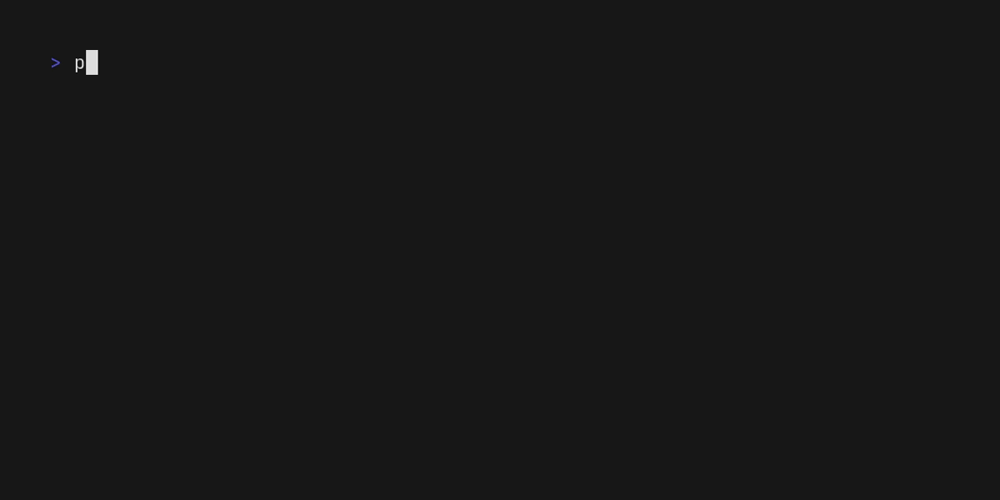

# 🛹 Pathflip

Pathflip is a CLI tool for FRC teams that use PathPlanner or Choreo for building autonomous routine paths.

You can create & tune a path for one side of the field (ex. red), and can use Pathflip to mirror the path to the other side (ex. blue).

Pathflip was developed in the 2024 FRC season for [Team 581](https://github.com/team581).

